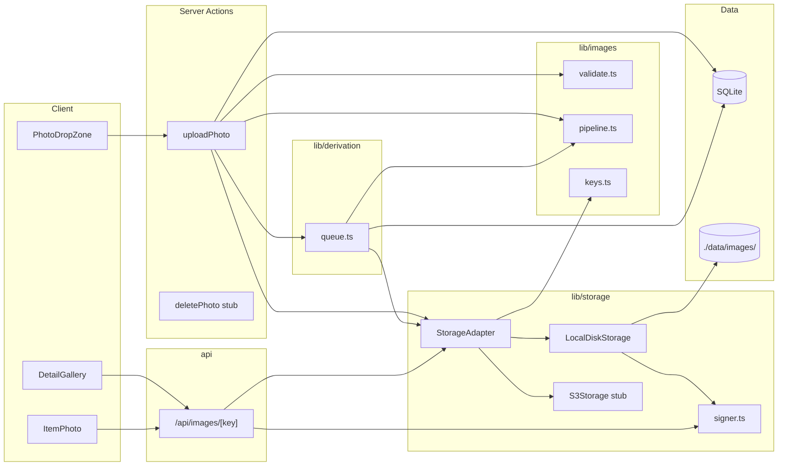

# Architecture — image-upload (F-001)

**PRD:** [../../prds/PRD_image-upload_2026-04-22.md](../../prds/PRD_image-upload_2026-04-22.md)
**Author:** Neo
**Date:** 2026-04-22
**Status:** Draft (awaiting user approval)

---

## 1. Where this feature lives

The feature spans four layers of the existing Next.js 15 App Router application:

| Layer | Module | F-001 role |
|-------|--------|-----------|
| HTTP | `src/app/api/images/[key]/route.ts` | Serves signed-URL-gated bytes to `` tags |
| Server Actions | `src/lib/actions/photos.ts` | `uploadPhoto` mutation (new file — sibling of existing `kept.ts`) |
| Validation | `src/lib/validators/kept.ts` | New `uploadPhotoSchema`; legacy presigned-URL schemas removed |
| Storage | `src/lib/storage/` | **New module** — `StorageAdapter` interface + `LocalDiskStorage` + `S3Storage` stub + signer |
| Derivation | `src/lib/derivation/queue.ts` | **New module** — in-process `p-queue` singleton, `concurrency: 2` |
| Image pipeline | `src/lib/images/` | **New module** — sharp workflow, magic-byte validation, key-path builder |
| Data | `src/lib/db/schema.ts` + `drizzle/0001_image_status.sql` | Adds `status`, `last_error` to `item_images` |
| UI | `src/components/ui/PhotoDropZone.tsx` + modifications to `AddItemDialog`, `DetailGallery`, `ItemPhoto` | Input + display surface |

The feature respects Kept's server-first default (CONSTITUTION §3). All mutation happens in Server Actions validated by Zod; DB access is confined to server code; no client-side `fs.*` or storage-module imports.

## 2. Module boundaries

Five new modules are introduced. Each has a single responsibility and a clean boundary:

- **`src/lib/storage/`** — owns "how bytes get written and read." Knows nothing about images, EXIF, sharp, or queues. Its public surface is the `StorageAdapter` interface and a `getStorage()` factory that returns the process singleton.
- **`src/lib/images/`** — owns "how bytes are validated and transformed." Depends on sharp, `file-type`-style magic-byte sniff, and nothing from `storage/`. The upload server action orchestrates the two: validate + transform in `images/`, write via `storage/`.
- **`src/lib/derivation/`** — owns "when derivation runs and at what concurrency." Depends on `storage/` (to write derivatives), `images/` (to resize), and `db/` (to update row state). Has no knowledge of server actions or HTTP.
- **`src/lib/actions/photos.ts`** — orchestrator. Accepts `FormData`, validates, transforms, writes, inserts DB row, enqueues derivation, returns. Depends on all three modules above.
- **`src/app/api/images/[key]/route.ts`** — HTTP-facing read path. Verifies signed URL, streams bytes. Depends only on `storage/` and `images/keys.ts` (for path-traversal rejection).

Dependency direction is one-way: `actions/` → `{storage, images, derivation}` → `{storage, images, db}`. No cycles.

## 3. Data flow — upload happy path

```mermaid
sequenceDiagram
    actor User
    participant C as Client (PhotoDropZone)
    participant SA as uploadPhoto action
    participant V as images/validate.ts
    participant P as images/pipeline.ts (sharp)
    participant S as StorageAdapter.write()
    participant DB as Drizzle (SQLite)
    participant Q as derivation/queue.ts
    participant D as derive job (async)

    User->>C: Drop / select photo
    C->>C: Client-side pre-check (size, magic bytes)
    C->>SA: FormData{itemId, file}
    SA->>V: sniff magic bytes + size + dimensions
    V-->>SA: ok (jpeg, 4MB, 4000x3000)
    SA->>P: strip EXIF + bake orientation
    P-->>SA: sanitized bytes
    SA->>S: write(items/{id}/{imgId}/original.jpg)
    S->>S: fs.writeFile + fsync
    S-->>SA: ok
    SA->>DB: INSERT item_images{status:'pending'}
    DB-->>SA: ok
    SA->>Q: enqueue(deriveVariants, imgId)
    SA-->>C: {success, imageId} (target ≤ 5s)
    C->>C: refresh item detail route

    Note over Q,D: Async — does not block client
    Q->>D: pick up job (≤2 slots active)
    D->>S: read(original.jpg)
    D->>P: resize → 200w thumb.webp, 800w display.webp
    D->>S: write(thumb.webp), write(display.webp)
    D->>DB: verify item exists; UPDATE status='ready', thumb_key, display_key
```

Failure modes and their handling:

| Failure point | Action |
|---|---|
| Client pre-check fails | Inline error, never touches server |
| Server-side magic-byte sniff fails | `ActionResult.success=false` with "Unsupported format" — no write, no row |
| Original write fails (disk full, readonly mount) | Error returned to client; no partial file left (fs.writeFile is atomic-enough per item key) |
| DB insert fails after original write | Server action catches, runs `storage.delete(originalKey)`, re-throws. No orphan file. |
| `queue.add` fails after DB insert (process crashes mid-ms-gap) | Row stays `pending`. Accepted v1 debt (ADR-003); manual `UPDATE status='failed' WHERE ...` documented |
| Derivation fails in worker | Job sets `status='failed'`, writes `last_error`. Original + DB row survive. UI shows warning overlay. |
| Item deleted during derivation | Worker re-reads `items` row before UPDATE; if absent, logs `derivation_aborted_item_deleted` and exits |
| Signed URL tampered | `/api/images/[key]` returns 401 |
| Path traversal attempted | Route returns 400 |

## 4. Architectural decisions

Four ADRs were finalised during brainstorm and reinforced here:

- **ADR-001 — pnpm** (package manager). Applies to F-019 Docker build later.
- **ADR-002 — Pluggable `StorageAdapter`** with `LocalDiskStorage` real + `S3Storage` stub. Backend resolved at module init via `STORAGE_BACKEND` env var.
- **ADR-003 — In-process `p-queue`** with `concurrency: 2`. Jobs lost on restart accepted as v1 debt.
- **ADR-004 — Magic-byte content sniffing** server-side before `StorageAdapter.write()`. Browser-supplied MIME is never trusted.

Four additional design decisions were locked during Bloom's Rounds 4–5:

- **Signer is a standalone helper, not part of the adapter interface.** `signer.ts` exports `signUrl(key, ttlSec)` and `verifySignedUrl(key, token) → boolean`. Only `LocalDiskStorage` uses them; `S3Storage.signedUrl()` will eventually delegate to the S3 SDK's native presigner. This decouples "how we sign" from "what we sign for." The `StorageAdapter.signedUrl` method internally delegates to `signer.ts` for the local backend.
- **Buffered upload via Next `FormData` default.** No Web Streams plumbing. 6 concurrent 20 MB uploads × ~30 MB peak per upload ≈ 180 MB transient RAM on a Pi 5 8 GB — well within budget. Streaming is an escape hatch if we ever target sub-1-GB hosts.
- **`console.log(JSON.stringify(...))` via a 10-line `src/lib/log.ts` helper.** No pino, no winston. Dev-only logs per PRD R-08; structured enough for `journalctl -u kept | jq`. A real log pipeline is an F-018 concern.
- **`vitest` for both unit and integration.** Integration tests spin up real SQLite + real filesystem (temp dir per test) + real sharp + `exiftool` spawn for EXIF verification. No mocks at the adapter boundary.

## 5. Conformance to CONSTITUTION §3 (architectural constraints)

| Constraint | How F-001 satisfies |
|---|---|
| Server-first; `"use client"` only for interactivity | Storage/derivation entirely server-side. `PhotoDropZone` is `"use client"` (drag events + file input), but all work delegates to the server action. |
| Mutations via Server Actions | `uploadPhoto` + `deletePhoto` stub in `src/lib/actions/photos.ts` follow existing `ActionResult<T>` envelope. |
| No `/api/*` unless external client needs it | Exception made for `/api/images/[key]` — required because `` is the external client. Documented as the feature's sole HTTP exception. |
| DB access server-only | `src/lib/storage/*`, `src/lib/derivation/*`, `src/lib/images/*` top each file with `import "server-only"`. |
| One Zod schema per entity in `src/lib/validators/` | `uploadPhotoSchema` added to `kept.ts` alongside existing schemas. |
| Photos are S3 keys only — no binary in DB | Schema `item_images` stores string keys. DB never holds bytes. Derivatives: two additional string keys per row. |

No constraint is broken or bent. The `/api/images/[key]` exception is intentional and limited.

## 6. Env surface

New env vars introduced in F-001 (documented in `.env.example` and `CLAUDE.md` during ship):

| Name | Example | Purpose | Default |
|---|---|---|---|
| `STORAGE_BACKEND` | `local` | Selects adapter at module init | `local` |
| `STORAGE_LOCAL_DIR` | `./data/images` | Filesystem root for `LocalDiskStorage` | `./data/images` |
| `IMAGE_URL_SECRET` | `<32+ random bytes>` | HMAC key for signed URLs | none — fails boot if missing |

`IMAGE_URL_SECRET` is checked at process start via a Zod env schema; missing or too-short secret crashes boot with a clear error.

## 7. High-level component interaction



Solid arrows = call dependencies. Every path from `Client` to `Data` is mediated by server actions or the image route.

## 8. Performance envelope

Target hardware (Pi 5, 8 GB, NVMe SSD) budget for a 4 MB JPEG upload, end-to-end persist:

| Stage | Budget | Notes |
|---|---|---|
| `FormData` receive | ~100–300 ms | LAN Gigabit-ish; mobile Wi-Fi variability adds but is outside server-side SLA |
| Magic-byte sniff + size + dimension | < 10 ms | In-memory |
| sharp EXIF-strip + orient | ~300–600 ms | Single-threaded for a 4 MP image |
| `fs.writeFile` + `fsync` | ~20–80 ms | NVMe |
| `INSERT item_images` | < 10 ms | SQLite WAL |
| `queue.add` | < 1 ms | In-process |
| **Total** | **< 1.5 s typical** | 5 s SLA has ~3.5 s headroom for network and Pi load |

Derivation (async, off the client's critical path):

| Variant | Budget | Notes |
|---|---|---|
| 200w thumb WebP | ~200 ms | Pi 5 single sharp job |
| 800w display WebP | ~500 ms | Pi 5 single sharp job |
| Write both to storage + UPDATE row | ~100 ms | |
| **Total per job** | **~800 ms** | 2-slot queue → ~400 ms per photo at throughput |

For the 100-item laptop bulk session:
- Upload phase: 100 uploads × 1.5 s at 6 concurrency ≈ 25 s wall clock for uploads themselves.
- Derivation phase: 100 derivations × 0.4 s amortized at 2 slots ≈ 40 s wall clock.
- Human think-time dominates: the 30-minute target has generous headroom for framing + reviewing photos.

## 9. What this architecture deliberately does NOT do

Restated from PRD for future readers:

- No fullscreen lightbox, no drag-reorder, no delete/replace UI, no set-as-hero (F-002).
- No durable queue / restart-resumable derivation (ADR-003 accepted debt).
- No cross-user isolation or auth (F-005 / F-006).
- No S3-backed image delivery (`S3Storage` throws). CDN / public-bucket / presigned-GET flows arrive when public hosting is committed.
- No disk-full warnings or health endpoint (F-018).
- No content-hash dedup (future enhancement).
- No admin view of failed photos (absorbed by F-018).

## 10. Handoff to Plan

Neo's design is done. Echo picks this up in the Plan sub-phase to generate the test plan and break implementation into Beads tasks, using `AC #1–36` as the starting point for test coverage and `§3–4` of this doc as the primary implementation sequence.
