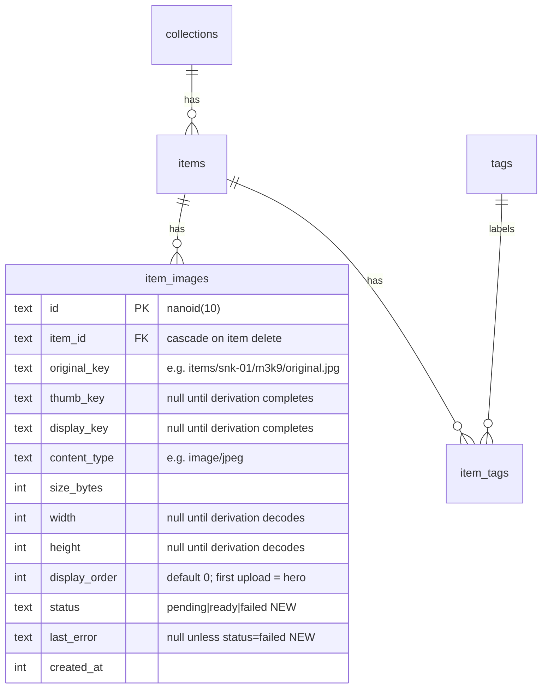
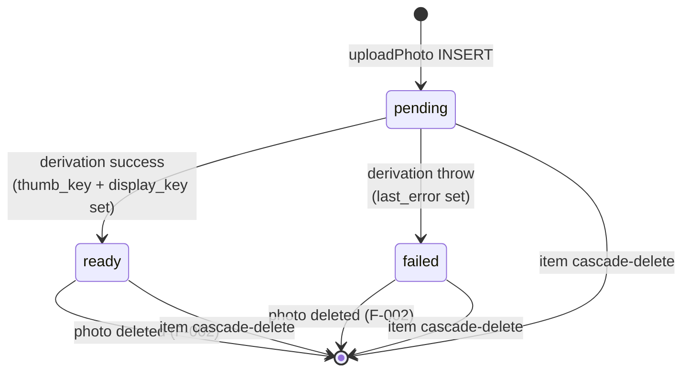

# Data Model — image-upload (F-001)

**PRD:** [../../prds/PRD_image-upload_2026-04-22.md](../../prds/PRD_image-upload_2026-04-22.md)
**Architecture:** [ARCHITECTURE.md](ARCHITECTURE.md)
**Status:** Draft (awaiting user approval)

---

## 1. Summary

F-001 makes exactly one schema change: **two new columns on `item_images`** that track the lifecycle of an uploaded photo. No new tables. No changes to `collections`, `items`, `tags`, or `item_tags`. Photo bytes are **never** stored in the DB — only opaque string keys that the `StorageAdapter` resolves.

## 2. Changes to `item_images`



### Added columns

| Name | Type | Nullable | Default | Notes |
|------|------|----------|---------|-------|
| `status` | `text` (SQLite) / `varchar(16)` when ported to Postgres | No | `'pending'` | `CHECK (status IN ('pending','ready','failed'))`. Lifecycle values only — never other strings. |
| `last_error` | `text` | Yes | `NULL` | Captures derivation error message when `status='failed'`. Free-form, truncated to 500 chars in the worker. |

No other columns on `item_images` are changed. No indexes are added in F-001 — the table is expected to stay under ~10k rows for years on a single household; status-based queries are rare. Add a partial index on `(status) WHERE status='pending'` if/when we introduce the boot-sweep (post-ADR-003).

### Drizzle schema delta

`src/lib/db/schema.ts` gains two fields on the existing `itemImages` table:

```ts
status: text("status", { enum: ["pending", "ready", "failed"] })
  .notNull()
  .default("pending"),
lastError: text("last_error"),
```

The `enum` generic keeps the type-checked union at the Drizzle layer; SQLite stores the underlying `text` and the runtime check constraint enforces it at the DB boundary.

## 3. Lifecycle state machine



Terminal transitions:
- `pending → ready` is the happy path and is the only transition the F-001 derivation worker can produce.
- `pending → failed` captures derivation errors (sharp threw, unsupported codec after upload, OOM, worker corruption).
- There is **no `failed → pending` retry transition in F-001**. Failed photos are effectively dead — user must delete and re-upload. A future feature may add a retry button on the failed-photo overlay.
- A `pending` row orphaned by a process crash mid-enqueue has no automated transition in F-001 (ADR-003). Manual SQL recovery is documented in the PRD Known Risks.

## 4. Key-path format (the "keys" in the key columns)

The storage key format is **adapter-agnostic** — the same string works for `LocalDiskStorage` (mapped under `STORAGE_LOCAL_DIR`) and any future `S3Storage` (mapped under a bucket prefix). Keys are owned by `src/lib/images/keys.ts`:

```
items/{itemId}/{imageId}/{variant}.{ext}
```

- `itemId` — the human-readable `items.id` (`snk-01`, `dec-04`).
- `imageId` — `nanoid(10)` generated by the server action. Shared across an image's three variants.
- `variant` — one of `original`, `thumb`, `display`.
- `ext` — `jpg` / `png` / `webp` for the original (matches input format); `webp` fixed for thumb/display.

Examples:
- `items/snk-01/m3k9P8a2Qw/original.jpg`
- `items/snk-01/m3k9P8a2Qw/thumb.webp`
- `items/snk-01/m3k9P8a2Qw/display.webp`

### Invariants enforced by `keys.ts`

The `buildKey(itemId, imageId, variant, ext)` function:

1. Rejects any `itemId` or `imageId` containing `..`, `/`, `\`, or control characters.
2. Rejects any `ext` not in the allowed set (`jpg`, `png`, `webp`).
3. Returns a normalized `posix.join(...)`-style path — always forward slashes, regardless of host OS.

The `parseKey(key)` companion reverses the parse and is used by `/api/images/[key]` to validate a requested key before touching storage. Any key failing parse → HTTP 400.

## 5. Migration — `drizzle/0001_image_status.sql`

Generated by `pnpm run db:generate` after the schema change. Expected content:

```sql
-- 0001_image_status.sql
-- Add lifecycle columns to item_images for F-001 image-upload.

ALTER TABLE `item_images` ADD COLUMN `status` TEXT NOT NULL DEFAULT 'pending'
  CHECK (`status` IN ('pending','ready','failed'));
ALTER TABLE `item_images` ADD COLUMN `last_error` TEXT;
```

### Migration safety

- **Forward.** Safe. Both columns have defaults or are nullable. No existing rows in the seeded dev DB (none have `item_images` rows at all pre-F-001).
- **Backward.** No down migration. Rolling back F-001 requires manual SQL (`ALTER TABLE item_images DROP COLUMN status; ALTER TABLE item_images DROP COLUMN last_error;`) **and** re-checking Drizzle schema TypeScript. Documented as a known risk in the PRD.
- **Postgres portability.** When the app migrates off SQLite, the same migration translates almost verbatim — `text` + `DEFAULT` + `CHECK` constraint are all standard. The only Drizzle-level change will be the `sqliteTable` → `pgTable` import swap.

## 6. Data that is deliberately NOT persisted

F-001 intentionally discards several categories of data. Capturing this here so future contributors don't "fix" these as bugs:

- **EXIF metadata** on all uploaded files. GPS coordinates, device make/model, timestamps, lens info — all stripped server-side in `src/lib/images/pipeline.ts` via `sharp().rotate().withMetadata({})` before the bytes ever reach `StorageAdapter.write()`. The "original" Kept stores is the EXIF-sanitized version. The raw browser-uploaded bytes are garbage-collected from memory with no disk footprint.
- **Original filenames** (`IMG_4521.HEIC`, `Mom's 50th 🎂.jpg`). Names are discarded; object keys are derived from `itemId + imageId`. Avoids filesystem encoding issues, path-length limits, and a whole class of injection attacks.
- **Content hashes.** No dedup in F-001. Two identical uploads create two `item_images` rows, two sets of storage keys, two derivations. Content-addressable storage is a future optimization.
- **Raw MIME header from the browser.** The validator trusts the magic-byte sniff, not the `contentType` field. The header *is* kept on the row as-written by the server (`content_type` column is populated from the sniffed type, not the header).
- **Upload session metadata.** No audit log of "user U uploaded file F at time T" beyond the structured log stream. No per-upload audit table. F-006 multi-user may add this when per-user attribution matters.

## 7. Relationships and cardinality

Unchanged from the pre-F-001 schema, restated for completeness:

- `items` **1 : N** `item_images` — an item has zero or more photos; a photo belongs to exactly one item. `ON DELETE CASCADE` on `item_images.item_id` — deleting an item deletes its image rows. **The cascade does NOT delete files from storage**; file deletion is the worker's job in F-001 during the `deleteItem` server action (which is already in `src/lib/actions/kept.ts` but does not yet clean storage). F-002 addresses this explicitly — until then, deleted items leave orphan files on disk. Documented as known v1 debt.
- `collections` **1 : N** `items` — unchanged.
- `items` **N : M** `tags` via `item_tags` — unchanged.

## 8. Type exports that downstream code consumes

`src/types/kept.ts` gains:

```ts
export type PhotoStatus = "pending" | "ready" | "failed";

export type ItemImage = typeof itemImages.$inferSelect; // auto-updated by Drizzle
```

`queries.ts::getItemWithRelations(id)` return shape adds a resolved `heroPhotoUrl` (signed URL for the hero variant at its current status) and `photos` array (one entry per `item_images` row with variant URLs resolved according to status).

```ts
export type PhotoView = {
  id: string;
  status: PhotoStatus;
  heroUrl: string;           // display variant if ready, else original (pending/failed)
  thumbUrl: string;          // thumb variant if ready, else original
  warning?: string;          // present when status === "failed"
};
```

## 9. Implications for tests

- **Integration fixtures** use an in-memory-style pattern: temp directory per test, fresh SQLite file, fresh `better-sqlite3` connection, fresh `sharp` worker, real file system writes. Teardown removes the temp dir.
- **Schema assertions** — integration tests assert that `item_images.status` is `pending` immediately after `uploadPhoto` returns and `ready` after the derivation queue drains (via `await queue.onIdle()`).
- **EXIF assertions** — a test uploads a known EXIF-loaded fixture JPEG, waits for persist, then spawns `exiftool -json <file>` and asserts the returned JSON has no `GPSLatitude`, `Make`, `Model`, or `DateTimeOriginal` tags.
- **Key format assertions** — tests inspect `item_images.original_key` and assert it matches the regex `^items/[a-z0-9-]+/[A-Za-z0-9_-]{10}/(original|thumb|display)\.(jpg|png|webp)$`.

## 10. What's NOT in this data model (anticipating future features)

For future-reader clarity, F-001 explicitly does not introduce:

- A `photo_deletions` table or soft-delete column. Deletions are hard (PRD decision).
- A `photo_jobs` or `derivation_runs` table. Queue state lives in memory only (ADR-003).
- A `photo_hashes` column for content-addressable storage.
- A `uploaded_by_user_id` FK. Multi-user arrives with F-006.
- A `photo_tags` table for gen-AI-generated tags. That entire capability is post-F-018.

These are deliberate omissions — the schema stays minimal so migrations stay cheap.
