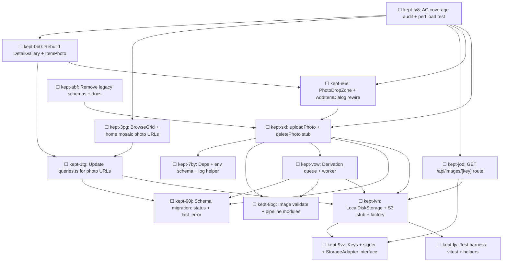

# Plan: image-upload (F-001)

**Feature:** image-upload
**Date:** 2026-04-22
**PRD:** [../PRD_image-upload_2026-04-22.md](../PRD_image-upload_2026-04-22.md)
**Architecture:** [../../design/image-upload/ARCHITECTURE.md](../../design/image-upload/ARCHITECTURE.md)
**Data model:** [../../design/image-upload/data-model.md](../../design/image-upload/data-model.md)
**API contracts:** [../../design/image-upload/api-contracts.md](../../design/image-upload/api-contracts.md)

---

## Tasks

15 Beads tasks. All labelled `epic:image-upload`, `roadmap:F-001`, `user:arthurtina724`, `branch:main`.

| Beads ID | Title | Labels | Depends on | Author | Created (UTC) |
|----------|-------|--------|-----------|--------|---------------|
| `kept-90j` | Schema migration: add status + last_error columns to item_images | `backend`, `db`, `story:US-001`, `story:US-007` | — | arthurtina724 | 2026-04-22T23:15:00Z |
| `kept-7by` | Add deps, env schema, and structured-log helper | `backend`, `config` | — | arthurtina724 | 2026-04-22T23:15:00Z |
| `kept-9vz` | Pure modules: keys + signer + StorageAdapter interface | `backend`, `security`, `story:US-004`, `story:US-009` | — | arthurtina724 | 2026-04-22T23:15:00Z |
| `kept-ljv` | Test harness: vitest config + integration helpers + exiftool wrapper | `test` | — | arthurtina724 | 2026-04-22T23:15:00Z |
| `kept-8og` | Image validate + pipeline modules | `backend`, `security`, `privacy`, `story:US-004`, `story:US-005` | — | arthurtina724 | 2026-04-22T23:15:00Z |
| `kept-ivh` | LocalDiskStorage + S3Storage stub + getStorage() factory | `backend`, `story:US-004` | `kept-9vz`, `kept-ljv` | arthurtina724 | 2026-04-22T23:15:00Z |
| `kept-vow` | Derivation queue + deriveVariants worker | `backend`, `async`, `story:US-007`, `story:US-008` | `kept-90j`, `kept-8og`, `kept-ivh` | arthurtina724 | 2026-04-22T23:15:00Z |
| `kept-sxf` | uploadPhoto + deletePhoto stub server actions | `backend`, `action`, `story:US-001`, `story:US-005`, `story:US-006` | `kept-90j`, `kept-7by`, `kept-8og`, `kept-ivh`, `kept-vow` | arthurtina724 | 2026-04-22T23:15:00Z |
| `kept-jod` | Image API route: GET /api/images/[key] | `backend`, `api`, `security`, `story:US-009` | `kept-9vz`, `kept-ivh` | arthurtina724 | 2026-04-22T23:15:00Z |
| `kept-1tg` | Update queries.ts to resolve photo URLs | `backend`, `query` | `kept-90j`, `kept-ivh` | arthurtina724 | 2026-04-22T23:15:00Z |
| `kept-e6e` | Shared PhotoDropZone component + AddItemDialog rewire | `frontend`, `ui`, `story:US-001`, `story:US-005` | `kept-sxf` | arthurtina724 | 2026-04-22T23:15:00Z |
| `kept-0b0` | Rebuild DetailGallery + ItemPhoto photoUrl branch | `frontend`, `ui`, `story:US-003` | `kept-1tg`, `kept-e6e` | arthurtina724 | 2026-04-22T23:15:00Z |
| `kept-3pg` | Wire photo URLs into BrowseGrid + home mosaic | `frontend`, `ui` | `kept-1tg` | arthurtina724 | 2026-04-22T23:15:00Z |
| `kept-abf` | Remove legacy schemas + update docs | `chore`, `docs` | `kept-sxf` | arthurtina724 | 2026-04-22T23:15:00Z |
| `kept-ty8` | AC coverage audit + performance load test | `test`, `coverage` | `kept-sxf`, `kept-jod`, `kept-0b0`, `kept-3pg`, `kept-e6e` | arthurtina724 | 2026-04-22T23:15:00Z |

---

## Dependency Graph



*(Arrows point from dependent → dependency. `kept-ty8 → kept-0b0` means ty8 cannot start until 0b0 is closed.)*

---

## Implementation Order (wave-based parallel execution)

### Wave 1 — Foundation (5 tasks in parallel, no dependencies between them)

- `kept-90j` — Schema migration
- `kept-7by` — Deps + env schema + log helper
- `kept-9vz` — Keys + signer + adapter interface (pure modules)
- `kept-ljv` — Test harness
- `kept-8og` — Image validate + pipeline (pure + sharp wrapping)

These five touch distinct files with no code-level overlap. Any teammate can pick any of them independently.

### Wave 2 — Storage concrete + async worker (2 tasks in parallel)

- `kept-ivh` — LocalDiskStorage + S3 stub + factory (unblocked by `9vz` + `ljv`)
- `kept-vow` — Derivation queue + worker (unblocked by `90j` + `8og` + `ivh`) — *technically starts slightly after `ivh` since it depends on it; can start the moment `ivh` lands*

### Wave 3 — Server-side integration (3 tasks in parallel)

- `kept-sxf` — uploadPhoto + deletePhoto stub (unblocked by `90j`, `7by`, `8og`, `ivh`, `vow`)
- `kept-jod` — Image API route (unblocked by `9vz`, `ivh`)
- `kept-1tg` — Queries.ts photo-URL resolution (unblocked by `90j`, `ivh`)

All three can start the moment Wave 2 finishes. They touch different files (`lib/actions/photos.ts`, `app/api/images/[key]/route.ts`, `lib/db/queries.ts`).

### Wave 4 — UI + cleanup (4 tasks, partial parallelism)

- `kept-e6e` — PhotoDropZone + AddItemDialog rewire (unblocked by `sxf`)
- `kept-3pg` — BrowseGrid + home mosaic photo URLs (unblocked by `1tg`) — parallel with `e6e`
- `kept-abf` — Remove legacy schemas + update docs (unblocked by `sxf`) — parallel with `e6e` and `3pg`
- `kept-0b0` — DetailGallery + ItemPhoto rebuild (unblocked by `1tg` + `e6e`) — starts slightly after `e6e`

### Wave 5 — Coverage gate

- `kept-ty8` — AC coverage audit + performance test — final task, blocks Construction→Operation transition.

### Critical path

Longest dependency chain (determines minimum cycle time):

```
9vz → ivh → vow → sxf → e6e → 0b0 → ty8
```

Seven tasks. With one implementer, plan for 6–8 days of focused work. With parallel implementers (agent-team mode), Wave 1 collapses to ~1–2 days and overall cycle time is closer to 3–4 days.

---

## Milestones

- **End of Wave 2:** Storage + derivation system working end-to-end in isolation (unit tests green). No UI, no server actions.
- **End of Wave 3:** `curl -F file=@x.jpg http://localhost:3000/<server-action-url>` successfully uploads and persists a photo via server action; `GET /api/images/[key]` returns bytes. Full backend working.
- **End of Wave 4:** Full UX working end-to-end in the browser; upload a photo from the AddItemDialog and see it render on the detail page.
- **End of Wave 5:** All 36 acceptance criteria mapped to passing tests. Ready for `/pdlc ship`.

---

## Notes for the implementing teammate(s)

- `pnpm install` is expected to pull sharp + p-queue + nanoid (already in `package.json`); verify the `onlyBuiltDependencies` whitelist covers them on fresh clones.
- Every new file in `src/lib/{storage,derivation,images,actions}/*` must begin with `import "server-only"`. This is CONSTITUTION-enforced and the linter will catch violations.
- When in doubt about error shape, return `ActionResult<T>` with a `code` field; see `api-contracts.md §7`.
- Migration `0001_image_status.sql` has no down migration by design — don't add one.
- Keep commits small (one Beads task per commit ideally); conventional-commit format with `(photos)` scope preferred.
